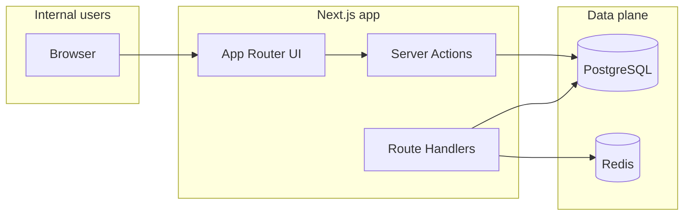
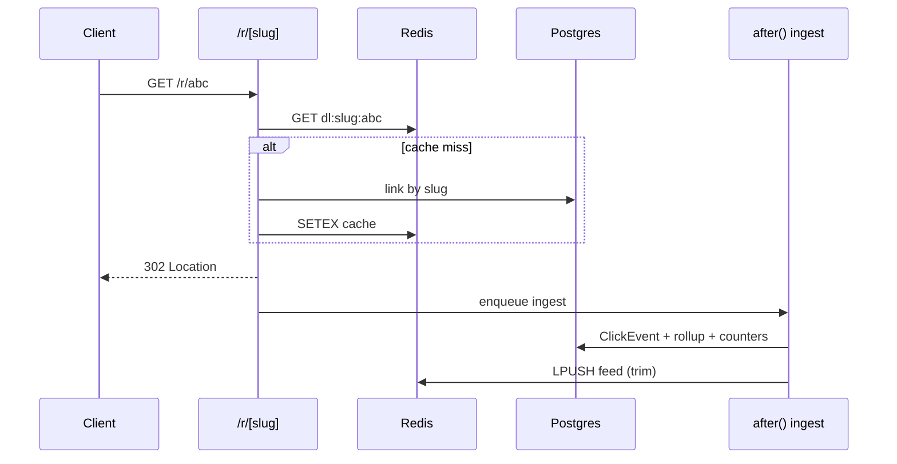

# Driffle Links — Architecture & Operations

Internal link management and campaign attribution for Driffle. This document is the single source of truth for system design, deployment, and evolution.

---

## 1. System architecture

| Layer | Responsibility |
|--------|------------------|
| **Edge / Node routes** | OAuth, health, CSV export, cron hooks, QR assets |
| **App Router (RSC + Server Actions)** | Dashboards, forms, RBAC-gated mutations |
| **Service layer** | Orchestration: links, slug cache, click ingest, Slack hooks |
| **Repositories** | Prisma queries isolated per aggregate |
| **PostgreSQL** | Source of truth: users, links, campaigns, clicks, rollups, audit |
| **Redis** | Slug cache, rate limits, click feed buffer, optional click queue |

**Stateless web tier**: any instance can serve traffic; session is JWT-based (no Prisma in Edge middleware — `getToken` from `next-auth/jwt`).



---

## 2. Folder structure (feature-first)

```
apps/web/
├── prisma/schema.prisma
├── Dockerfile
├── src/
│   ├── app/                    # routes: (app) shell, login, r/[slug], api/*
│   ├── features/               # vertical slices
│   │   ├── analytics/
│   │   ├── auth/
│   │   ├── campaigns/
│   │   ├── dashboard/
│   │   ├── links/
│   │   └── utm-builder/
│   ├── shared/
│   │   ├── lib/                # rbac, cn()
│   │   ├── types/
│   │   ├── ui/                 # shadcn-style primitives
│   │   └── validations/        # Zod + env
│   ├── server/
│   │   ├── db/
│   │   ├── redis/
│   │   ├── repositories/
│   │   └── services/
│   ├── auth.ts
│   ├── auth.config.ts
│   └── middleware.ts
```

---

## 3. Prisma schema (summary)

| Model | Purpose |
|--------|---------|
| `User` / `Account` / `Session` | NextAuth + `UserRole` enum |
| `Campaign` | Grouping, tags, lifecycle |
| `Link` | Slug, destination, expiry, tags, status, counters |
| `ClickEvent` | Append-only stream; bot flag; visitor hash |
| `Referrer` / `Device` | Normalized dimensions |
| `AnalyticsRollup` | Daily buckets (`scopeType` + `scopeId` uniqueness) |
| `AuditLog` | Mutations trace |

**Indexing strategy (high level)**

- `ClickEvent`: `(linkId, createdAt DESC)`, `(visitorHash, linkId, createdAt)`, `(isBot, createdAt)` — fast per-link timelines and bot filtering.
- `Link`: unique `slug`; filters on `status`, `expiresAt`, `campaignId`; GIN on `tags` for tag filters at scale.
- `AnalyticsRollup`: `(scopeType, scopeId, bucketStart)` for dashboard rollups.

---

## 4. API architecture

| Route | Auth | Notes |
|--------|------|------|
| `GET/POST /api/auth/[...nextauth]` | Public | Google OAuth |
| `GET /api/health` | Public | Docker / Deployer probes |
| `GET /r/[slug]` | Public | Redirect + `after()` ingest |
| `GET /api/export/links` | Session + `readAnalytics` | CSV download |
| `GET /api/links/[id]/qr` | Session + `readAnalytics` | SVG QR for short URL |
| `POST /api/cron/rollup` | `Bearer CRON_SECRET` | Aggregation job hook |

**Server Actions (examples)**

- `createLinkAction` / `deleteLinkAction` — `src/features/links/actions.ts`
- `createCampaignAction` — `src/features/campaigns/actions.ts`

Pattern: `const session = await auth()` → `can(role, permission)` in services → `revalidatePath`.

---

## 5. Redirect middleware / route

Implemented as **`GET` Route Handler** `src/app/r/[slug]/route.ts` (Node runtime for `ioredis` + Prisma).

1. Rate limit (Redis) per IP and per slug window.
2. Resolve slug: Redis cache → Postgres fallback → populate cache.
3. Validate status + expiry → `302` or `410`.
4. `after(() => clickIngestService.ingest(...))` — non-blocking.
5. On ingest failure → best-effort `LPUSH` to `dl:queue:clicks` for a worker.



**Tradeoff:** True Edge colocation would need Redis over HTTP (for example Upstash) or a split “resolve” micro-endpoint. Here we optimize **self-hosted Docker** and **Prisma compatibility** over sub-10ms global Edge.

---

## 6. Analytics ingestion flow

- **Parse**: referer domain, coarse UA classification, bot heuristic.
- **Privacy**: store `visitorHash` = SHA-256 of `(NEXTAUTH_SECRET, dayBucket, ip, ua)` — no raw IP persisted.
- **Write path**: transactional create `ClickEvent`, increment `Link.clickCount`, upsert `AnalyticsRollup` (`DAY`, `LINK`, `scopeId=linkId`).
- **Unique clicks**: MVP stores full events; **`uniqueClicks` in rollup** reserved for cron recomputation (`POST /api/cron/rollup`).

---

## 7. Aggregation strategy

| Tier | What | Latency |
|------|------|---------|
| **Online** | Increment `AnalyticsRollup.totalClicks` per event | ms (same txn as click) |
| **Scheduled** | Distinct `visitorHash` per day, campaign-level rollups, backfill queue | minutes |

Cron contract: `Authorization: Bearer ${CRON_SECRET}`.

---

## 8. Redis caching strategy

| Key pattern | TTL | Use |
|-------------|-----|-----|
| `dl:slug:{slug}` | 3600s | Hot redirect resolution |
| `dl:rl:ip:{ip}:{window}` | 60s | Redirect rate limit |
| `dl:rl:slug:{slug}:{window}` | 60s | Abuse protection |
| `dl:feed:clicks` | list trim 200 | “Live” internal feed / future WS |
| `dl:queue:clicks` | unbounded list | Failure buffer → worker |

**Analytics API caching (V2):** add `dl:analytics:link:{id}:{range}` in repository reads.

---

## 9. RBAC design

| Role | Capabilities |
|------|----------------|
| **ADMIN** | Users (future UI), delete links, all analytics, settings |
| **EDITOR** | Create/edit links, campaigns, UTM workflows, analytics |
| **VIEWER** | Read-only analytics (including CSV export in current MVP) |

Implementation: `src/shared/lib/rbac.ts` + service-level `requirePermission` / explicit `can()` checks.

---

## 10. Dashboard architecture

- **Server Components** load aggregates from `AnalyticsRollup` + `ClickEvent` group-bys.
- **Charts**: client island with `next/dynamic` + Recharts (`ssr: false`) to keep TTFB lean.
- **Motion**: Framer Motion on KPI strip and sidebar nav affordances.

---

## 11. Security checklist

- [x] Google OAuth restricted to `@driffle.com` (`signIn` callback)
- [x] JWT sessions (middleware uses `getToken`, no Prisma on Edge)
- [x] Zod on Server Actions inputs and env bootstrap
- [x] SSRF-style destination blocking (`url-safety.ts`)
- [x] Redirect rate limiting (Redis)
- [x] SQL injection: Prisma parameterization only
- [x] XSS: React escaping; no `dangerouslySetInnerHTML`
- [x] CSRF: NextAuth for OAuth; mutations are POST + Server Actions (same-site cookies)
- [x] Audit log on link create/delete
- [ ] Rotate `NEXTAUTH_SECRET` / `CRON_SECRET` on compromise playbook
- [ ] Add CSP headers at reverse proxy (Deployer / nginx)

---

## 12. Performance checklist

- [x] Redirect path avoids synchronous analytics
- [x] `after()` for post-response ingest
- [x] Lazy-loaded charts
- [x] Redis slug cache
- [x] Rollups for dashboard time series
- [ ] Pagination on links table (currently capped `take: 50`)
- [ ] DB partitioning for `ClickEvent` at very large scale

---

## 13. Dockerfile (`apps/web/Dockerfile`)

Multi-stage: `npm ci` → `prisma generate` → `next build` → `npm prune --omit=dev` → slim runtime with `next start`.

**First deploy migrations:** run from a one-off job or init container:

```bash
docker compose -f docker-compose.prod.yml run --rm web npx prisma migrate deploy
```

For greenfield without migration files yet, use `prisma db push` once, then check in migrations for CI/CD.

---

## 14. `docker-compose.prod.yml` (root)

- Services: `web`, `db` (Postgres 16), `redis` (AOF persistence)
- Named volumes for Postgres + Redis
- Healthchecks on all three services
- `depends_on` with `condition: service_healthy` for Deployer-compatible startup ordering

Validate locally:

```bash
docker compose -f docker-compose.prod.yml config
```

---

## 15. `.env.example` (root)

See repository `.env.example` for required variables (`NEXTAUTH_*`, `GOOGLE_*`, `DATABASE_URL`, `REDIS_URL`, `PUBLIC_APP_URL`, `SHORT_LINK_HOST`, optional `CRON_SECRET`, `SLACK_WEBHOOK_URL`).

---

## 16. Slack & scheduled reports (architecture)

- **Service:** `src/server/services/slack-notify.service.ts` — `postSlack`, `postDailyDigestExample`.
- **Trigger:** cron container or Deployer scheduled task hits internal API + calls Slack with aggregates only.
- **Reports:** CSV already available; PDF/HTML “share pages” = V2 (signed token routes).

---

## 17. MVP roadmap (8–12 weeks engineering calendar)

1. Hardening pass: pagination, optimistic UI, toast system, delete/edit link UI.
2. User admin UI: role changes, deactivate users, audit filters.
3. UTM presets stored in DB + bulk CSV import.
4. Unique visitor cron + campaign-level rollups wired to `POST /api/cron/rollup`.
5. Optional: Upstash/HTTP Redis for geo-distributed Edge redirects.

---

## 18. V2 roadmap

- Shareable read-only analytics pages (time-limited signed URLs).
- WebSocket or SSE live click feed in dashboard.
- Multi-region read replicas + rollup writer service.
- Content moderation pipeline for destinations (VirusTotal hook, internal allowlist).
- Feature flags for experimental attribution models.

---

## 19. Scalability notes

- **Click table growth:** partition by month on `ClickEvent` when row count exceeds comfortable single-table maintenance (~100M+ depending on instance).
- **Rollup cardinality:** keep `scopeType` narrow; avoid high-cardinality dimensions in rollup rows — store top-N JSON snapshots (already stubbed in schema).
- **Redis memory:** set `maxmemory-policy` in production Redis config (not in compose by default — add when sizing is known).

---

## 20. Deployer deployment instructions

1. **Build image** in CI or on Deployer host: `docker compose -f docker-compose.prod.yml build web`.
2. **Secrets**: inject `.env` via Deployer secret store — never commit real values.
3. **DNS**: internal app on `links.internal.*`; short domain `go.driffle.com` points to same load balancer (path `/r/*`) or dedicated ingress rule.
4. **Migrations**: run `npx prisma migrate deploy` as a pre-start or one-off task before traffic shifts.
5. **Health**: Deployer should use `GET /api/health` (compose healthcheck already does).
6. **Cron**: register HTTP call to `POST /api/cron/rollup` with `Authorization: Bearer $CRON_SECRET` nightly + weekly digest calling `postSlack`.

---

## 21. Cursor AI coding rules

See `.cursor/rules/driffle-links.mdc` (feature-first layout, RBAC in services, redirect performance rules, env validation discipline).

---

## 22. Tradeoff analysis (selected)

| Decision | Upside | Downside |
|----------|--------|----------|
| Node redirect route | Prisma + `ioredis` in-process, simpler Docker | Not globally colocated at Edge |
| JWT vs DB session in middleware | Edge-safe auth gate without Prisma | Role changes need token refresh / `session.update()` |
| Rollup in same txn as click | Immediate dashboard signal | Write amplification — mitigate later with async worker |
| Visitor hash salted daily | Privacy-friendly uniqueness heuristic | Not perfect cross-device uniques |

---

## Appendix: Local development

### Local auth bypass (`npm run dev` only)

Set in `apps/web/.env.local` (never in production — gated on `NODE_ENV === "development"`):

```bash
DISABLE_AUTH=true
NEXT_PUBLIC_DISABLE_AUTH=true   # optional; shows a hint in the user menu
```

Effects: middleware does not require a JWT; `getAppSession()` returns a synthetic **ADMIN** session backed by a real DB user (`dev-local@driffle.com`, upserted on first request). Google OAuth is skipped. **`next start` / Docker production builds ignore this flag.**

### Quick local demo (Docker + Next)

1. **Start Docker Desktop** (or any Docker daemon), then from the repo root:

   ```bash
   docker compose -f docker-compose.local.yml up -d
   ```

   This runs Postgres on **host port 5433** (avoids clashing with a local Postgres on 5432) and Redis on **6379**.

2. **Env file** — copy the template and add Google OAuth (required to sign in):

   ```bash
   cp apps/web/.env.local.example apps/web/.env.local
   ```

   Fill `GOOGLE_CLIENT_ID` and `GOOGLE_CLIENT_SECRET`. In [Google Cloud Console](https://console.cloud.google.com/apis/credentials), create an OAuth client (Web) and set **Authorized redirect URI** to:

   `http://localhost:3000/api/auth/callback/google`

   Use a **@driffle.com** test user (the app rejects other domains).

3. **Schema + app:**

   ```bash
   cd apps/web
   npm install
   npx prisma db push
   npm run dev
   ```

4. Open **http://localhost:3000** → sign in → create a link → open a short URL as **http://localhost:3000/r/{slug}**.

5. Stop infra when done: `docker compose -f docker-compose.local.yml down`.

### Without Docker

Use any reachable Postgres + Redis URLs in `.env.local` and the same `prisma db push` + `npm run dev` steps.

### Legacy one-liner (monolithic `.env` at repo root)

```bash
cd apps/web
cp ../../.env.example ../../.env
npm install
npx prisma migrate dev   # or db push for prototype
npm run dev
```

Short URL in dev: `http://localhost:3000/r/{slug}` (production maps `go.driffle.com` → same app).
