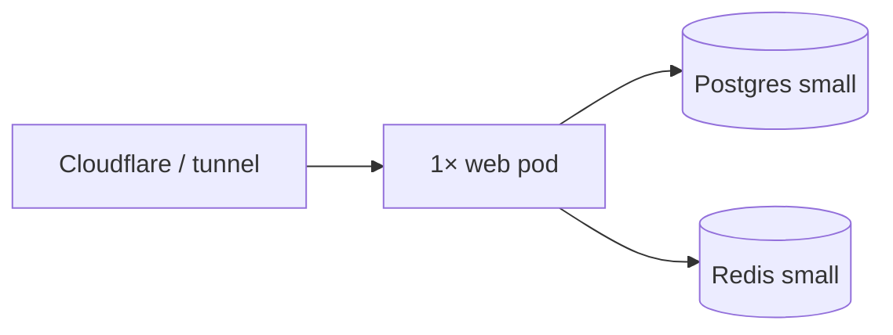

# Driffle Links — Kubernetes capacity (lean / startup)

Internal URL shortener **monolith**: Next.js + PostgreSQL + Redis. Goal: **smallest bill that still handles internal traffic**, scale only when metrics hurt.

Share this with DevOps for first prod deploy; upgrade when you hit the **“scale triggers”** at the bottom.

---

## Philosophy

| Principle | What we do |
|-----------|------------|
| **Min resources first** | Start with **1 web pod**, **smallest managed Postgres**, **tiny Redis** (or Redis sidecar — see below). |
| **Max output on that stack** | Warm redirects are cache-bound; this footprint is enough for **~5–15 sustained redirect RPS** and a small internal team. Spikes above that need scale-up or Phase 1 async clicks. |
| **HA later** | Second web pod, Multi-AZ DB, and HPA **after** you care about deploy uptime or measured load — not day one. |
| **Same compose mental model** | Prod K8s ≈ one `web` + `db` + `redis`; no extra services until Phase 1 worker. |

---

## Minimum viable stack (recommended v1)



| Component | Startup choice | Approx. capacity on this size |
|-----------|----------------|-------------------------------|
| **web** | **1 replica**, 100m request / 500m limit CPU, **384–512Mi** request memory | Dashboard + **~5–15 RPS** redirects (warm slug cache); brief unavailability on rolling deploy |
| **PostgreSQL** | **1 vCPU, 2 GiB** class (e.g. burstable micro/small), 20–30 GiB disk, **single-AZ** | Fine for low click volume; **writes** (analytics) bite before reads do |
| **Redis** | **128–256 MiB** managed, or **Redis 7 sidecar** in same pod/network (dev/staging style) | Slug cache + rate limits; no persistence required |

**Expected monthly shape (order of magnitude):** one small VM-equivalent for app + smallest RDS + smallest Redis — treat as **internal tool tier**, not marketplace tier.

---

## Web Deployment spec (copy-paste baseline)

| Setting | Lean value |
|---------|------------|
| `replicas` | **1** (→ **2** when you need zero-downtime deploys or CPU &gt; ~60% sustained) |
| `resources.requests` | `cpu: 100m`, `memory: 384Mi` |
| `resources.limits` | `cpu: 500m`, `memory: 768Mi` |
| `readinessProbe` | `GET /api/health/ready:3000` |
| `livenessProbe` | `GET /api/health:3000` |
| HPA | **Skip initially**; add 1→3 at 70% CPU when traffic grows |

**Prisma:** append `?connection_limit=5` to `DATABASE_URL` on a single pod (no PgBouncer until **2+ pods** or connection errors).

**Redis:** **1 TCP connection per pod** (`ioredis` singleton). Sidecar Redis: `redis://127.0.0.1:6379` in the same pod — acceptable for internal v1 if ops accepts pod restart = cache flush.

**Migrate:** one-off Job `npx prisma migrate deploy` before rollout; **`RUN_MIGRATE_ON_START=0`**.

---

## What you get vs. what you give up (1 pod, small DB)

| You get | You give up |
|---------|-------------|
| Low cost, simple ops | No AZ failover; DB/Redis down = app down |
| Enough for internal links + analytics for a small org | Rolling deploy may drop in-flight requests (~seconds) |
| Redirects fast when slug is in Redis | Campaign **click storms** can saturate DB writes (Phase 0) |

---

## Edge vs. app (keep app tiny)

- **Cloudflare** (or ingress): TLS, basic WAF, optional rate limit — protects the single pod.
- App defaults: **300 req/min/IP**, **2000 req/min/slug** (`REDIRECT_RL_*`). Do not raise in prod unless load-testing.

---

## Throughput and volume expectations (lean v1)

Numbers below assume the **minimum viable stack** above and **Phase 0** behavior: each redirect still triggers **Postgres click ingest** in `after()` (see [ARCHITECTURE.md](./ARCHITECTURE.md)). Order-of-magnitude only — validate with your campaign patterns and metrics.

### Redirects (read path)

| Scenario | Expectation |
|----------|-------------|
| **Comfortable sustained load** | **~5–15 RPS** overall with **warm slug cache** (Redis hit) |
| **Short bursts** | Often **tens of RPS for seconds** if the pod CPU limit (500m) and Redis keep up; not guaranteed at 100m CPU request |
| **Per client IP** (default app limits) | **~5 RPS max per IP** (`REDIRECT_RL_IP_PER_MIN=300`) — single load tester hits **429** quickly; real users spread across many IPs |
| **Per short link (slug)** | **~33 RPS max per slug** (`REDIRECT_RL_SLUG_PER_MIN=2000`) — one hot link may **429** before the pod is exhausted |
| **Latency (warm cache, in-region)** | **~10–100 ms p95** when not rate-limited; cache misses add Postgres read latency |

**Redirect-only upper bound (if nothing else broke):**

| Sustained RPS | Approx. redirects / day |
|---------------|-------------------------|
| 5 | ~430k |
| 15 | ~1.3M |

On lean v1 you typically **do not** reach these redirect-only ceilings because **click writes** limit you first (next section).

### Clicks and analytics (usual bottleneck — Phase 0)

Each redirect can produce a **multi-statement Postgres transaction** (click row, counters, rollups, dimension upserts).

| Postgres (lean) | Sustainable click ingest (Phase 0) | Redirects / day if ~1 click per redirect |
|-----------------|-----------------------------------|------------------------------------------|
| **1 vCPU / 2 GiB** | **~2–10 writes/s sustained** (campaign-dependent) | **~170k–860k / day** |
| Same, **spike** | **~20–50 writes/s for minutes** may be tolerable | Short email/push spikes; watch CPU and lag |

**Planning bands for lean v1:**

| Use case | Clicks / day (order of magnitude) |
|----------|-----------------------------------|
| Internal day-to-day | Well within capacity |
| Single modest campaign | **Low thousands – low tens of thousands** over a few hours |
| Heavy / viral campaign | **Risky** — expect **429s**, DB pressure, or slow dashboards |
| Marketplace-scale traffic | **Out of scope** — scale up + [Phase 1 async ingest](#references) (#31) |

### Admin and product usage

| Dimension | Lean v1 |
|-----------|---------|
| Concurrent dashboard users | **~10–30** typical |
| Links stored | Thousands – tens of thousands (UI lists **50** per page today) |
| CSV export | Up to **5,000** links per download |

### Storage (Postgres ~20–30 GiB disk)

`ClickEvent` drives growth (indexes + append-only stream).

| Rough row count | Notes |
|-----------------|--------|
| **~1–5M** click rows | Reasonable “still comfortable on small disk” band; plan retention/partitioning (Phase 2) beyond that |
| **~5 writes/s** | ~5M rows in **~12 days** if sustained continuously |
| **~1 write/s** | ~5M rows in **~58 days** |

Row size varies with referrer/device normalization; treat days-to-fill as **estimate only**.

### What limits you first (typical order)

1. **Postgres write rate** (campaign clicks) — Phase 0 synchronous ingest  
2. **Per-IP / per-slug rate limits** — abuse, load tests, or one very hot link  
3. **Single pod CPU** (500m limit) — SSR admin + redirects together  
4. **Redis memory** — unlikely at internal scale unless queues grow unbounded (cap in Phase 1)

### Stakeholder summary

| Question | Lean v1 answer |
|----------|----------------|
| Internal Driffle daily use? | **Yes** |
| One marketing campaign, normal list size? | **Yes** (low k – low tens of k clicks over hours) |
| Large public viral link? | **No** without scale-up and Phase 1+ |
| Viral / marketplace traffic? | **No** — not this footprint |

---

## Cron (minimal)

| Job | When |
|-----|------|
| `prisma migrate deploy` | Pre-deploy only |
| `POST /api/cron/rollup` | Nightly (small `CronJob` or external ping) |

---

## Scale triggers (when to spend more)

Add resources when **any** of these persist for a day — not before:

| Signal | Lean upgrade |
|--------|----------------|
| Web CPU **&gt; 60%** or memory pressure / OOM | **2 pods**, 512Mi request; optional HPA max 3 |
| Redirect p95 **&gt; 200 ms** in-region (warm links) | 2 pods + confirm Redis/DB not remote cross-AZ |
| Postgres CPU **&gt; 60%** or insert lag on clicks | Bigger instance **or** Phase 1 async ingest (issue #31) |
| Deploy downtime noticed by users | **2 web replicas** + `maxUnavailable: 0` rolling update |
| Compliance / data durability | Multi-AZ RDS, daily backups (you should have backups anyway) |

---

## One-page summary for DevOps

```
Production v1 (startup):
  Ingress/Cloudflare → 1× driffle-links-web (100m CPU, 384Mi RAM)
                     → Postgres 1 vCPU / 2GiB (single-AZ, 20Gi disk)
                     → Redis 128–256MiB OR sidecar

Handles: internal team + ~5–15 redirect RPS sustained (warm cache).
Scale:    2 pods + slightly larger RDS when metrics say so.
Do not:   Multi-AZ + 6 pods + PgBouncer on day one.
```

---

## References

- [ARCHITECTURE.md](./ARCHITECTURE.md)
- [SETUP.md](./SETUP.md) — env vars
- Phase 1 (#31) when click write load exceeds small Postgres
