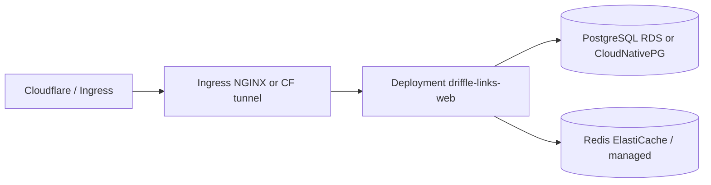

# Driffle Links — Kubernetes capacity guide (DevOps)

Internal URL shortener monolith: **Next.js web** + **PostgreSQL** + **Redis**. No separate redirect microservice (Phase 0–1).

Use this document for initial prod sizing, HPA baselines, and dependency limits. Tune with real metrics after go-live.

---

## Traffic assumptions (internal Driffle)

| Profile | Redirect RPS (peak) | Dashboard users | Notes |
|---------|---------------------|-----------------|--------|
| **Baseline** | &lt; 5 | &lt; 30 concurrent | Day-to-day marketing links |
| **Campaign spike** | 20–80 | &lt; 50 | Email/push with short links |
| **Stress** | 100–300 | &lt; 100 | Requires Phase 1 async ingest; watch Postgres writes |

Redirect path is **Redis cache + optional Postgres read**; click analytics still write to Postgres (Phase 0: synchronous `after()` ingest).

---

## Recommended starting topology (production)

| Component | HA | Min replicas / nodes |
|-----------|----|----------------------|
| **web** | Yes | **2** pods (anti-affinity across nodes) |
| **PostgreSQL** | Yes | Primary + standby (managed RDS Multi-AZ or equivalent) |
| **Redis** | Optional | 1 primary (+ replica if managed HA); AOF or RDB per policy |

---

## Web Deployment (`driffle-links-web`)

Built from `apps/web/Dockerfile` — `next start` on port **3000**.

### Starter resources (per pod)

| | Requests | Limits | Rationale |
|---|----------|--------|-----------|
| **CPU** | 250m | 1000m | Next.js SSR + redirect handlers; burst on cold start |
| **Memory** | 512Mi | 1Gi | `.next` + Node heap; increase if OOM during build-less runtime |

### Replicas & HPA (starting point)

| Setting | Value |
|---------|--------|
| `minReplicas` | **2** |
| `maxReplicas` | **6** (raise after Phase 1 worker split if needed) |
| Scale metric | CPU **70%** avg over 3m, or ingress **RPS** if available |
| `minReadySeconds` | 10 |
| `readinessProbe` | `GET /api/health/ready` port 3000, `timeoutSeconds: 3`, `periodSeconds: 10` |
| `livenessProbe` | `GET /api/health` port 3000, `periodSeconds: 30` |

**Redis connections:** one `ioredis` client per Node worker ≈ **1 connection per pod** (not per request). Size Redis `maxclients` ≥ `(web_pods × 2)` + headroom for workers/cron.

**Postgres connections:** set Prisma `connection_limit` **5–10 per pod**. With 2–6 pods, use **PgBouncer** (transaction mode) or RDS Proxy if total &gt; ~40 connections.

### Environment (required)

See repo `.env.example`. Critical for K8s:

- `DATABASE_URL`, `REDIS_URL`, `NEXTAUTH_SECRET`, `NEXTAUTH_URL`, `PUBLIC_APP_URL`
- `RUN_MIGRATE_ON_START=0` in prod — run **`prisma migrate deploy`** as a **Job** before rollout
- Do **not** set `PUBLIC_APP_NO_AUTH` in prod without explicit process approval

Optional tuning:

- `REDIRECT_RL_IP_PER_MIN` (default **300**) — app-layer IP limit per 60s
- `REDIRECT_RL_SLUG_PER_MIN` (default **2000**) — per-slug limit
- Prefer **Cloudflare / ingress rate limits** for edge abuse; keep app limits as backstop

---

## PostgreSQL

### Starter size (baseline internal)

| | Suggestion |
|---|------------|
| **Instance** | 2 vCPU, **4–8 GiB** RAM (e.g. `db.t4g.medium` class) |
| **Storage** | 50 GiB gp3/ssd, autoscaling enabled |
| **IOPS** | Default until click volume grows; watch write IOPS on campaigns |

### Growth signals (scale up or Phase 1 async ingest)

- Sustained CPU &gt; 60% on primary
- Write latency p95 &gt; 20ms on `ClickEvent` inserts
- Table size &gt; tens of millions of `ClickEvent` rows → partitioning (Phase 2)

**Backups:** daily snapshots + PITR; RTO/RPO per internal SLO (suggest RPO ≤ 24h for this tool unless compliance says otherwise).

---

## Redis

| | Suggestion |
|---|------------|
| **Memory** | **256 MiB – 512 MiB** (baseline); slug cache + rate limits + queues |
| **Policy** | `maxmemory-policy` **volatile-lru** on keys with TTL; cap `dl:queue:clicks` in Phase 1 |
| **Persistence** | AOF **optional** (cache + rate limits are rebuildable); prefer managed Redis |

---

## Ingress & TLS

- Terminate TLS at **Cloudflare** or ingress; forward `X-Forwarded-For` / **`CF-Connecting-IP`**
- Timeouts: **60s** sufficient; redirect responses are fast
- Body size: default; no large uploads except CSV export (authenticated)

---

## Jobs & cron (Kubernetes)

| Job | Schedule | Command |
|-----|----------|---------|
| **migrate** | Pre-deploy / manual | `npx prisma migrate deploy` |
| **rollup** | Nightly | `POST /api/cron/rollup` with `Authorization: Bearer $CRON_SECRET` |

Use **CronJob** or external scheduler (Deployer/Airflow) hitting internal service URL.

---

## Capacity cheat sheet (order-of-magnitude)

| Redirect RPS (sustained) | Web pods | Postgres | Redis | Comments |
|--------------------------|----------|----------|-------|----------|
| &lt; 10 | 2 × (0.25 CPU, 512Mi) | 2 vCPU / 4GiB | 256MiB | Comfortable baseline |
| 10–50 | 2–3 × (0.5 CPU, 512Mi) | 2–4 vCPU / 8GiB | 512MiB | Monitor DB write load (clicks) |
| 50–150 | 3–6 × (0.5–1 CPU, 1Gi) | 4 vCPU / 16GiB + PgBouncer | 512MiB–1GiB | Plan **Phase 1** async click pipeline |
| &gt; 150 | Revisit architecture | Read replica for analytics UI | Dedicated | Not monolith-only without Phase 1+ |

**Latency target (warm cache):** redirect p95 **&lt; 100 ms** in-region (excludes client network).

---

## Pre-go-live checklist

- [ ] Migration Job applied; `SKIP` automatic `db push` on pod start
- [ ] Readiness probe uses `/api/health/ready`
- [ ] Secrets in K8s Secret / external store (not in image)
- [ ] `connection_limit` × replicas ≤ Postgres budget (or PgBouncer)
- [ ] HPA + PDB (`minAvailable: 1`) on web Deployment
- [ ] Cloudflare rate limit + WAF on public hostname
- [ ] SigNoz / logs for 429 rate, readiness failures, Redis memory

---

## References

- [ARCHITECTURE.md](./ARCHITECTURE.md) — components and Redis key patterns
- [SETUP.md](./SETUP.md) — env vars including `REDIRECT_RL_*`
- GitHub Issue #30 (Phase 0), #31 (Phase 1 ingest)
